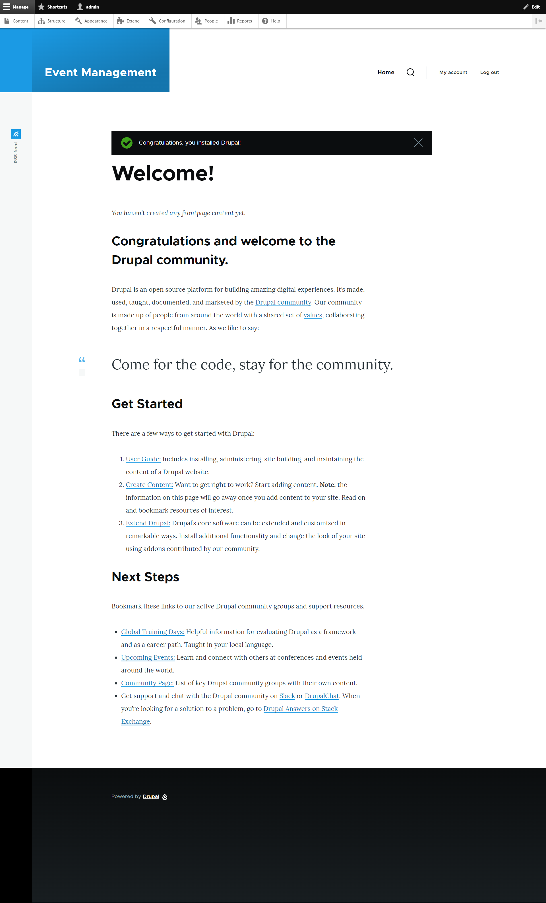
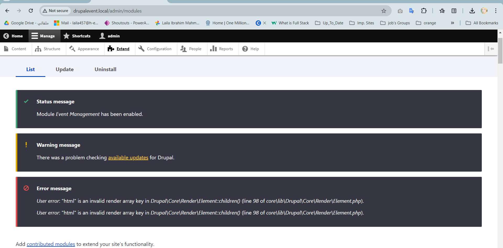
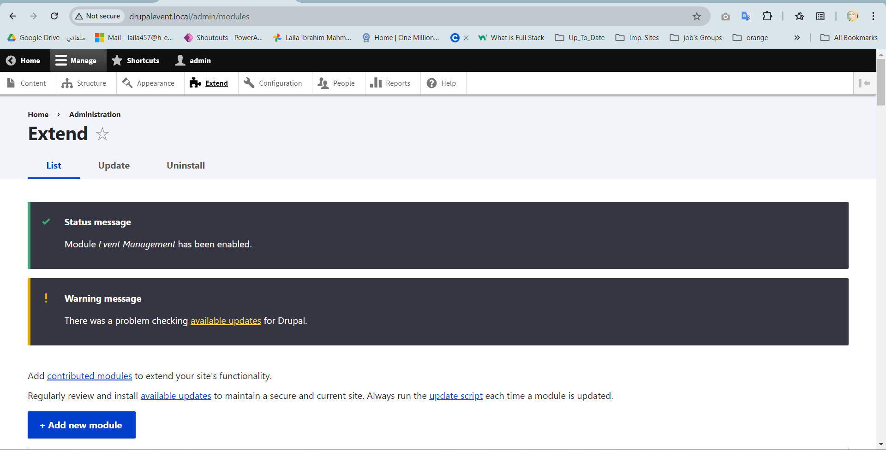
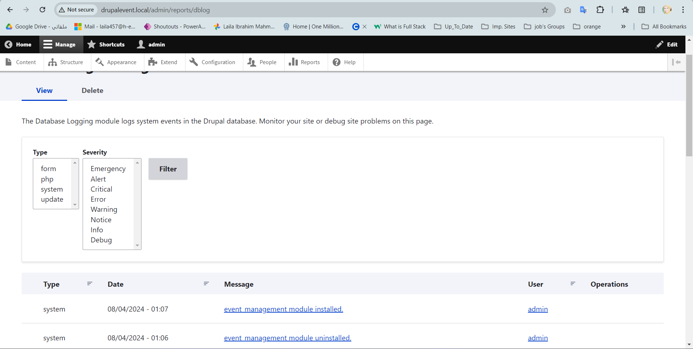
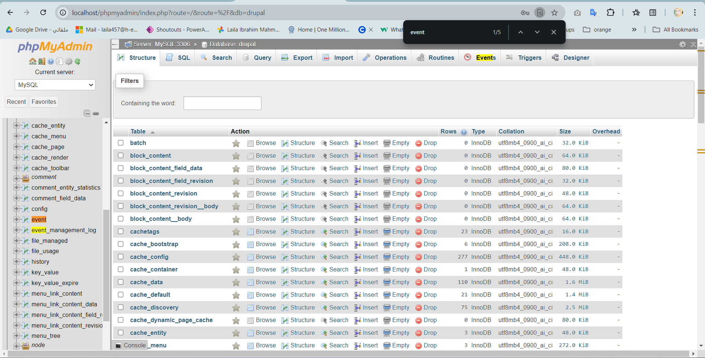
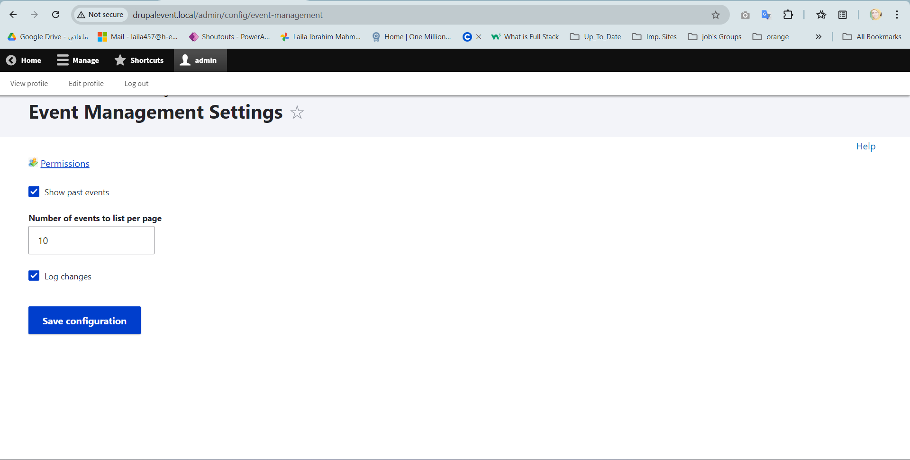
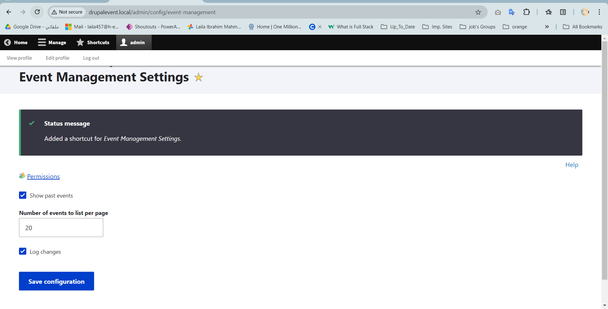
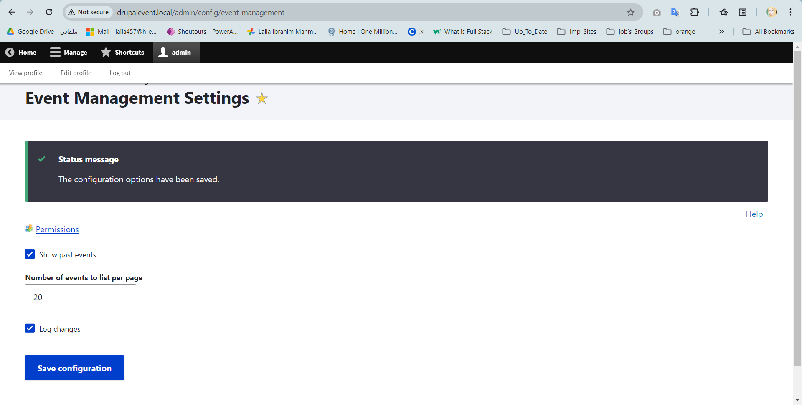
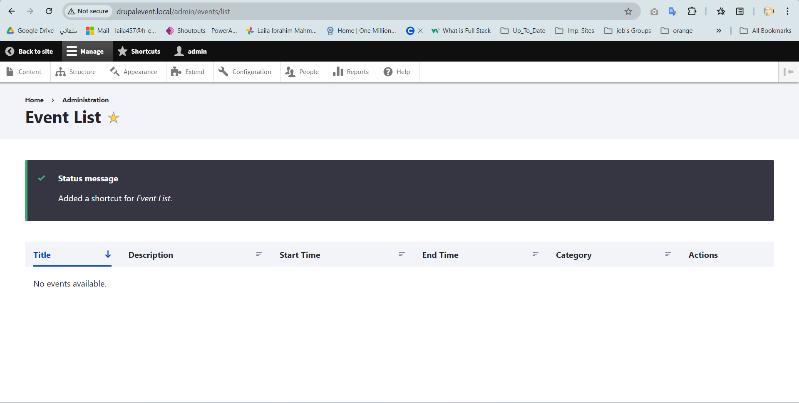

# Drupal Event Management

# task clarifications: To develop an 'Events Management' custom module for Drupal 10 with PHP 8.2 and MySQL 8.0, follow these steps:
 ## Back-end Development:
  1. Create Custom Module to install it and its' Event Attributes:
     * Title
     * Image
     * Description
     * Start and End Time (ensure end time does not exceed start time)
     * Category
     * publish option to publish or not 

  2. CRUD Operations for Events:
      * Create: Form for adding a new event.
      * Read: List and detail views for events.
      * Update: Form for editing an event.
      * Delete: Option to delete an event.

  3. when install this module , by default Custom Database Table `event_management_log` will be dropped if exist and table will be 
     install and create (This table is used to log when the user changes the module's  configuration)

  4. This Module Has Configuration Page with: 
      * The option to show or hide past events.
      * A number of events to list on the listing page.
      * log changes in `event_management_log`
     
 ## Front-end Development:
  1. Event Listing Page:
      * Fetch and display a list of published events.
      * Paginate based on the number set in the configuration.

  2. Event Details Page:
      * Display details of a selected event.

  3. Drupal Block:
      * List the latest 5 created events.
      * Place the block in a suitable region on the site.
 
## Steps to Develop the Module:
  1. change the environment to use php version 8.2.18 and mysql 8.3.0 and install Drupal 10 by composer:
        `bash
         composer create-project drupal/recommended-project drupal_event ^10
        `

 2. init an empty Git Repository in the same directory installed:
        `bash
         git init
        `
    
 3. Create a new MySQL database for Drupal installation. For example:
        `MySQL
          mysql -u 'root' -p

          CREATE DATABASE drupal;

          CREATE USER 'drupaluser'@'localhost' IDENTIFIED BY 'password';

          GRANT ALL PRIVILEGES ON drupal.* TO 'drupaluser'@'localhost';

          FLUSH PRIVILEGES;

          EXIT;
        `
        `MYSQL 
           mysql -u 'drupaluser' -p 
        ` 
        And Enter Password :)

        `MYSQL 
          SHOW DATABASES;
        `
        Checked the database `drupal` is really created or not :)

 4. Set Up Web Server : 
        - Set web server's document root to the web directory within project. For example, if you are using Apache in 
           WAMP, you might update VirtualHost configuration as follows:
         * Open WAMP and click on the WAMP icon in the system tray. Navigate to Apache > httpd.conf to open the main Apache 
           configuration file.
         * Ensure the following line is uncommented (remove the # if present) in httpd.conf to include the virtual hosts 
           configuration:
              `Apache 
                Include conf/extra/httpd-vhosts.conf
              `
         * Open C:\wamp64\bin\apache\apache2.4.59\conf\extra\httpd-vhosts.conf in a text editor. 
         * Add a new VirtualHost configuration block to point to Drupal project's web directory. 
            C:\wamp64\www\drupal_event\web the actual path to Drupal project and mydrupalsite.local domain.
             `Apache
                <VirtualHost *:80>
                  ServerName drupalevent.local
                  DocumentRoot "C:/wamp64/www/drupal_event/web"

               <Directory "C:/wamp64/www/drupal_event/web/">
                  Options Indexes FollowSymLinks
                  AllowOverride All
                  Require all granted
               </Directory>

                 ErrorLog "C:/wamp64/logs/drupalevent_error.log"
                 CustomLog "C:/wamp64/logs/drupalevent_access.log" combined
               </VirtualHost>
             `
         * Open C:\Windows\System32\drivers\etc\hosts in a text editor with administrator privileges.
         * Add the following line to map drupalevent.local to 127.0.0.1:
            `plaintext
              127.0.0.1 drupalevent.local
            `
         * Restart WAMP.
 5. Open `http://drupalevent.local/core/install.php` And Install Drupal: 
         * After select language ex. English here.
         * I will select `standard Profile`...why?
            explain: from drupal profile(standard,Minimal,Demo) standard will be a good choice for: 
              Best Choice for Development: The Standard profile is recommended for most use cases, including module development.
              It provides a good balance of features and flexibility, including content types, user roles, and some commonly used 
              modules. This profile is a good starting point for custom module development as it provides a solid foundation 
              without unnecessary bloat. 
            Features: It includes essential modules like the content editor, views, and some other key functionalities needed for 
             a standard site.
         * Follow the remaining installation steps, such as configuring database as above and site settings.
         * Site Name `Event Management`  & Site Email Address `admin@drupalevent.local` & Username `admin` & password 
           `admindrupalevent` 
 6. successfully website is Live Now `drupalevent.local` :) as in: 
       
    
 7. Basic Module Directory Structure: In Drupal 10, a typical custom module directory structure includes several key files and 
        folders. Here is an overview of the recommended structure:
        `arduino
           modules/custom/
                    └── event_management/
                          ├── event_management.info.yml
                          ├── event_management.module
                          ├── event_management.install
                          ├── event_management.permissions.yml
                          ├── event_management.routing.yml
                          ├── event_management.links.menu.yml
                          ├── src/
                          │    ├── Controller/
                          │    │    └── EventManagementController.php
                          │    ├── Form/
                          │    │     └── EventForm.php
                          │    └── Plugin/
                          │        └── Block/
                          │             └── EventBlock.php
                          ├── templates/
                          │     └── event-template.html.twig
                          ├── config/
                          │     └── install/
                          │          └── event_management.settings.yml
                          └── tests/
                               └── src/
                                    └── Functional/
                                          └── EventManagementTest.php

        `
        * YAML Files: .info.yml, .permissions.yml, .routing.yml, .links.menu.yml for module metadata, permissions, routing, and 
           menu links.
        * PHP Files: .module, .install, and various PHP classes under the src directory for controllers, forms, plugins, etc.
        * Twig Templates: Template files in the templates directory.
        * Configuration: Default configuration in the config/install directory.
        * Tests: Functional and unit tests in the tests directory.
    
 8. Create the Module Directory and Files:
       * Create a directory for module at modules/custom/event_management.
            Inside this directory, create the following files:
              event_management.info.yml
              event_management.module
              src/Controller/EventController.php
              src/Form/EventForm.php
              src/Form/EventDeleteForm.php
              src/Form/SettingsForm.php
              src/Entity/Event.php
              src/EventService.php
 9. Define the Module Info `event_management.info.yml`
 10. define event entity `Event.php`
 11. Define EventForm to handle crud operations for events `EventForm`
 12. Define Delete event `EventDeleteForm`
 13. Define controller to handle list of event and event details in `EventController.php`
 14. create Shema for event_management_log in `event_management.install`
 15. create configuration page in `SettingsForm.php`
 16. define the configuration schema for settings in a `event_management.schema.yml`
 17. add routing in `event_management.routing.yml`
 18. Start In Front Side: For Event Listing Page in Event Listing Template (templates/event-list.html.twig) and The listEvents() 
  method in EventController (already created) fetches and displays the events.
 19. For Event Details Page in Event Detail Template (templates/event-detail.html.twig) and The viewEvent() method in 
   EventController (already created) fetches and displays the event details.
 20. Drupal Block : Create Block Class (src/Plugin/Block/LatestEventsBlock.php) and block Template 
 (templates/latest-events-block.html.twig)

## features to add or customize for more check:
 1. add `help btn` to my custom module :) 
 2. implement a custom help page. This help page can then be linked through a help icon in module's admin interface. Create 
   the Help Controller `src/Controller/HelpController.php`.
 3. modify the settingsForm : Update the SettingsForm class to include a help icon that links to the help page.
 4. Add a Help Icon : define CSS to event module's library file `event_management.libraries.yml` (This file is used to define and 
    manage CSS, JavaScript, and other assets that are used in module.)
    note: Usage: 
       * CSS/JS Files: To include and manage frontend assets like CSS and JavaScript files.
       * Libraries: You define libraries here that can be attached to various parts of Drupal site, such as forms, pages, or 
         blocks.
         ..... here I will use it to define CSS :)
 5. Create the CSS file `css/event_management.css` and add style to it :)
 6. Modify the buildForm method in SettingsForm to include the `help-link` class
 7. add `permissions icon` to my custom module :)
 8. Place the icon image in module's directory `event_management/images/permission-icon.png`.
 9. check step 4 above.
 10. in `css/event_management.css` add style of permission icon
 11. Attach to SettingsForm class to render the permission link with an icon next to it.
 12. create a configuration icon for custom module and link it to configuration page .. Place the icon image in 
    module's directory `event_management/images/config-icon.png`
 13. check step 9 above.
 14. in `css/event_management.css` add style of config icon
 15. Attach to SettingsForm to render the config link with an icon next to it.
 16. Use a hook to add the configuration link with an icon to the admin toolbar. Update the `event_management.module` file
 17. enhance my custom module with custom events and subscribers by using `Event API` to create and manage custom events... so you 
    can trace specific actions related to events, such as when an event is created, updated, or deleted.
 18. Create custom event classes that will be dispatched when certain actions occur `src/Event/EventCreated.php`, 
    `src/Event/EventUpdated.php` and `EventDeleted.php`.
 19. Dispatch these events in CRUD operations where appropriate, such as in controller or entity form. 
   `src/Controller/EventController.php` or `src/Form/EventForm.php` ... here I will add my events in `EventForm.php`
 20. Implement subscribers to handle these events and perform actions or logging as needed in 
   `src/EventSubscriber/EventSubscriber.php`
 21. define it in `event_management.services.yml`.... ( This file is used to define and configure services for custom module.)
   note: Usage: 
      * Event Subscribers: To define services such as event subscribers that listen to and handle custom events.
      * Service Dependencies: You configure services like database connections, entity managers, or custom service classes here.
      * Event Dispatchers: If you’re using custom events and need to register event subscribers or dispatchers, you would 
        configure them in this file.
    ..... here I will use it to define Event Subscribers :)

 22. `Drupal` provides a `logging system` via the logger service. This is useful for tracing errors in your custom module.
 23. Inject the Logger Service: Use Dependency Injection to get the logger service in your class in `EventService.php` but here i 
   will use `Exception Handling` try and catch
 24. `Exception Handling` Catch exceptions where they might occur and handle them appropriately in `EventController` and `Forms`
 25. add custom error page ... add the error page routing and create error controller

# errors detected and solved checked when try to install and test my module: 
   1. [x] Trusted Host Settings: Not enabled
      The trusted_host_patterns setting is not configured in settings.php. This can lead to security vulnerabilities. It is highly 
         recommended that you configure this. See Protecting against HTTP HOST Header attacks for more information.
   2. [x] Critical security announcements
      Failed to fetch security advisory data:
         See Troubleshooting the advisory feed for possible causes and resolutions.
         Check your local system logs for additional error messages. 
   3. [x] GuzzleHttp\Exception\RequestException: cURL error 60: SSL certificate problem: unable to get local issuer certificate (see https://curl.haxx.se/libcurl/c/libcurl-errors.html) for https://updates.drupal.org/release-history/drupal/current?site_key=x78XkSXT6LVfniwbZtUbaMzjD7EkGAgzT5O_Uj7u1Ds&version=10.0.0&list=automated_cron%2Cbig_pipe%2Cblock%2Cblock_content%2Cbreakpoint%2Cckeditor5%2Ccomment%2Cconfig%2Ccontact%2Ccontextual%2Cdatetime%2Cdblog%2Cdynamic_page_cache%2Ceditor%2Cfield%2Cfield_ui%2Cfile%2Cfilter%2Chelp%2Chistory%2Cimage%2Clink%2Cmenu_link_content%2Cmenu_ui%2Cmysql%2Cnode%2Coptions%2Cpage_cache%2Cpath%2Cpath_alias%2Csearch%2Cshortcut%2Csystem%2Ctaxonomy%2Ctext%2Ctoolbar%2Ctour%2Cupdate%2Cuser%2Cviews%2Cviews_ui in GuzzleHttp\Handler\CurlFactory::createRejection() (line 211 of C:\wamp64\www\drupal_event\vendor\guzzlehttp\guzzle\src\Handler\CurlFactory.php).
   4. [x] Database Isolation Level
         REPEATABLE-READ
           For the best performance and to minimize locking issues, the READ-COMMITTED transaction isolation level is recommended. 
            See the setting MySQL transaction isolation level page for more information.
   5. [x] Drupal core update status
            Failed to get available update data.
           There was a problem checking available updates for Drupal.
   6. [x] The website encountered an unexpected error. Please try again later.
         Error: Interface "Drupal\Core\EventSubscriber\EventSubscriberInterface" not found in include() (line 10 of 
            modules\custom\event_management\src\EventSubscriber\EventSubscriber.php).
   7. [x] Fatal error: Declaration of Drupal\event_management\Form\EventForm::save(array &$form, Drupal\Core\Form\FormStateInterface $form_state) must be compatible with Drupal\Core\Entity\EntityForm::save(array $form, Drupal\Core\Form\FormStateInterface $form_state) in C:\wamp64\www\drupal_event\web\modules\custom\event_management\src\Form\EventForm.php on line 108
   8. [x]  success in enabled but get `Error message`as below:
       * User error: "html" is an invalid render array key in Drupal\Core\Render\Element::children() (line 98 of 
          core\lib\Drupal\Core\Render\Element.php).
       * User error: "html" is an invalid render array key in Drupal\Core\Render\Element::children() (line 98 of 
          core\lib\Drupal\Core\Render\Element.php).
          ............. solved as:  
          ............. solved uninstall and install successfully as in: 
          ............. solved as: 
          ............. solved as: 
          ............. solved as:  ...........
   9. [x] after save configraration Setting in Page get an error as blow: 
   The website encountered an unexpected error. Please try again later.

Drupal\Core\Database\DatabaseExceptionWrapper: SQLSTATE[42S22]: Column not found: 1054 Unknown column 'message' in 'field list': INSERT INTO "event_management_log" ("message", "timestamp") VALUES (:db_insert_placeholder_0, :db_insert_placeholder_1); Array ( [:db_insert_placeholder_0] => Drupal\Core\StringTranslation\TranslatableMarkup Object ( [string:protected] => Configuration settings updated. [arguments:protected] => Array ( ) [translatedMarkup:protected] => Configuration settings updated. [options:protected] => Array ( ) [stringTranslation:protected] => Drupal\Core\StringTranslation\TranslationManager Object ( [translators:protected] => Array ( [30] => Array ( [0] => Drupal\Core\StringTranslation\Translator\CustomStrings Object ( [translations:protected] => Array ( [en] => Array ( ) ) [settings:protected] => Drupal\Core\Site\Settings Object ( [storage:Drupal\Core\Site\Settings:private] => Array ( [hash_salt] => H2bx5L2UT0CeKT7egWRt2wXR3pBElZkK0-9nuwtyVwITEMZlbExGoZwxlPwWoOr_eEteB3SWCA [update_free_access] => [container_yamls] => Array ( [0] => C:\wamp64\www\drupal_event\web/sites/default/services.yml ) [trusted_host_patterns] => Array ( [0] => ^drupalevent\.local$ ) [file_scan_ignore_directories] => Array ( [0] => node_modules [1] => bower_components ) [entity_update_batch_size] => 50 [entity_update_backup] => 1 [migrate_node_migrate_type_classic] => [config_sync_directory] => sites/default/files/config_-ZJV5yrXV6mPCSupD1Cc2Nu7nDJZDVxQSxGn7hY1T7FsSLgoMqIHZEwMZsvbyua15IpPLX4jZA/sync [http_client_config] => Array ( [proxy] => Array ( [http] => http://drupalevent.local:8080 [https] => http://drupalevent.local:8080 [no] => Array ( [0] => 127.0.0.1 [1] => localhost ) ) ) ) ) [_serviceIds:protected] => Array ( ) [_entityStorages:protected] => Array ( ) ) ) ) [sortedTranslators:protected] => Array ( [0] => Drupal\Core\StringTranslation\Translator\CustomStrings Object ( [translations:protected] => Array ( [en] => Array ( ) ) [settings:protected] => Drupal\Core\Site\Settings Object ( [storage:Drupal\Core\Site\Settings:private] => Array ( [hash_salt] => H2bx5L2UT0CeKT7egWRt2wXR3pBElZkK0-9nuwtyVwITEMZlbExGoZwxlPwWoOr_eEteB3SWCA [update_free_access] => [container_yamls] => Array ( [0] => C:\wamp64\www\drupal_event\web/sites/default/services.yml ) [trusted_host_patterns] => Array ( [0] => ^drupalevent\.local$ ) [file_scan_ignore_directories] => Array ( [0] => node_modules [1] => bower_components ) [entity_update_batch_size] => 50 [entity_update_backup] => 1 [migrate_node_migrate_type_classic] => [config_sync_directory] => sites/default/files/config_-ZJV5yrXV6mPCSupD1Cc2Nu7nDJZDVxQSxGn7hY1T7FsSLgoMqIHZEwMZsvbyua15IpPLX4jZA/sync [http_client_config] => Array ( [proxy] => Array ( [http] => http://drupalevent.local:8080 [https] => http://drupalevent.local:8080 [no] => Array ( [0] => 127.0.0.1 [1] => localhost ) ) ) ) ) [_serviceIds:protected] => Array ( ) [_entityStorages:protected] => Array ( ) ) ) [defaultLangcode:protected] => en ) ) [:db_insert_placeholder_1] => 1722724219 ) in Drupal\event_management\Form\SettingsForm->submitForm() (line 125 of modules\custom\event_management\src\Form\SettingsForm.php). 
  10. [x] error when saved Configuration as in below: 
  The website encountered an unexpected error. Please try again later.

Drupal\Core\Database\IntegrityConstraintViolationException: SQLSTATE[HY000]: General error: 1364 Field 'user' doesn't have a default value: INSERT INTO "event_management_log" ("operation", "details", "timestamp") VALUES (:db_insert_placeholder_0, :db_insert_placeholder_1, :db_insert_placeholder_2); Array ( [:db_insert_placeholder_0] => Configuration Update or Create [:db_insert_placeholder_1] => Drupal\Core\StringTranslation\TranslatableMarkup Object ( [string:protected] => Configuration settings updated. [arguments:protected] => Array ( ) [translatedMarkup:protected] => Configuration settings updated. [options:protected] => Array ( ) [stringTranslation:protected] => Drupal\Core\StringTranslation\TranslationManager Object ( [translators:protected] => Array ( [30] => Array ( [0] => Drupal\Core\StringTranslation\Translator\CustomStrings Object ( [translations:protected] => Array ( [en] => Array ( ) ) [settings:protected] => Drupal\Core\Site\Settings Object ( [storage:Drupal\Core\Site\Settings:private] => Array ( [hash_salt] => H2bx5L2UT0CeKT7egWRt2wXR3pBElZkK0-9nuwtyVwITEMZlbExGoZwxlPwWoOr_eEteB3SWCA [update_free_access] => [container_yamls] => Array ( [0] => C:\wamp64\www\drupal_event\web/sites/default/services.yml ) [trusted_host_patterns] => Array ( [0] => ^drupalevent\.local$ ) [file_scan_ignore_directories] => Array ( [0] => node_modules [1] => bower_components ) [entity_update_batch_size] => 50 [entity_update_backup] => 1 [migrate_node_migrate_type_classic] => [config_sync_directory] => sites/default/files/config_-ZJV5yrXV6mPCSupD1Cc2Nu7nDJZDVxQSxGn7hY1T7FsSLgoMqIHZEwMZsvbyua15IpPLX4jZA/sync [http_client_config] => Array ( [proxy] => Array ( [http] => http://drupalevent.local:8080 [https] => http://drupalevent.local:8080 [no] => Array ( [0] => 127.0.0.1 [1] => localhost ) ) ) ) ) [_serviceIds:protected] => Array ( ) [_entityStorages:protected] => Array ( ) ) ) ) [sortedTranslators:protected] => Array ( [0] => Drupal\Core\StringTranslation\Translator\CustomStrings Object ( [translations:protected] => Array ( [en] => Array ( ) ) [settings:protected] => Drupal\Core\Site\Settings Object ( [storage:Drupal\Core\Site\Settings:private] => Array ( [hash_salt] => H2bx5L2UT0CeKT7egWRt2wXR3pBElZkK0-9nuwtyVwITEMZlbExGoZwxlPwWoOr_eEteB3SWCA [update_free_access] => [container_yamls] => Array ( [0] => C:\wamp64\www\drupal_event\web/sites/default/services.yml ) [trusted_host_patterns] => Array ( [0] => ^drupalevent\.local$ ) [file_scan_ignore_directories] => Array ( [0] => node_modules [1] => bower_components ) [entity_update_batch_size] => 50 [entity_update_backup] => 1 [migrate_node_migrate_type_classic] => [config_sync_directory] => sites/default/files/config_-ZJV5yrXV6mPCSupD1Cc2Nu7nDJZDVxQSxGn7hY1T7FsSLgoMqIHZEwMZsvbyua15IpPLX4jZA/sync [http_client_config] => Array ( [proxy] => Array ( [http] => http://drupalevent.local:8080 [https] => http://drupalevent.local:8080 [no] => Array ( [0] => 127.0.0.1 [1] => localhost ) ) ) ) ) [_serviceIds:protected] => Array ( ) [_entityStorages:protected] => Array ( ) ) ) [defaultLangcode:protected] => en ) ) [:db_insert_placeholder_2] => 1722724582 ) in Drupal\mysql\Driver\Database\mysql\ExceptionHandler->handleExecutionException() (line 43 of core\modules\mysql\src\Driver\Database\mysql\ExceptionHandler.php).
  11. [x] Solved after save configraration setting in configuration page as in 
  12. [x] when try to run route `http://drupalevent.local/admin/events/add` ..Get Error directly as below: 
      The website encountered an unexpected error. Please try again later.
      Error: Call to a member function getEntityTypeId() on null in Drupal\Core\Entity\EntityForm->getBaseFormId() (line 68 of 
         core\lib\Drupal\Core\Entity\EntityForm.php).
  13. [x] successfully get the event List as in Image 

  14. [x] when try to create event, i get this error as below:
     The website encountered an unexpected error. Please try again later.

RuntimeException: Controller "Drupal\event_management\Controller\EventController::viewEvent()" requires that you provide a value for the "$event_id" argument. Either the argument is nullable and no null value has been provided, no default value has been provided or because there is a non optional argument after this one. in Symfony\Component\HttpKernel\Controller\ArgumentResolver->getArguments() (line 81 of C:\wamp64\www\drupal_event\vendor\symfony\http-kernel\Controller\ArgumentResolver.php).
                      
## To Insure Event Custom Module is correctly implemented 
  # Step-by-Step Verification
  1. Enable the Module: 
     * Go to the Extend page (/admin/modules).
     * Enable custom module (Event Management).
  2. Check Installation: 
     * Ensure that the database tables (event and event_management_log) are created correctly.
     * You can check this by accessing the database directly using a tool like phpMyAdmin or using Drupal’s Devel module.
  3. Check Configuration Page:
     * Navigate to the configuration page of module (`/admin/config/event_management/settings`).
     * Ensure the form loads correctly and you can save the settings.
  4. CRUD Operations:
     * Create: Navigate to the form to add a new event and submit it
       - Verify that the event is saved in the database.
       - Check the file system for the uploaded images (if any).
     * Read: Navigate to the event listing page and detail page.
       - Ensure the event details are displayed correctly.
     * Update: Edit an existing event and save the changes.
       - Verify that the changes are saved in the database.
     * Delete: Delete an event and ensure it is removed from the database.
  5. Custom Block: 
     * Place the "Latest Events" block in a region via the block layout page (/admin/structure/block).
     * Verify that the block displays the latest events correctly.
  # Debugging and Logging:
     * Watchdog Logging: Use Drupal’s logging system to log any errors or important events.
       Example: `\Drupal::logger('event_management')->notice('Event created with ID: @id', ['@id' => $event_id]);`
     * Devel Module: Install and enable the Devel module to help with debugging.
     * Xdebug: Use Xdebug for step-by-step debugging if you’re working in a local development environment.
  # Unit Testing and Automated Testing:
     1. Unit Testing:
        * Write PHPUnit tests for custom module.
        * Place tests in the `tests/src/Unit` directory of module.
        * Run tests using the command: `phpunit -c core/phpunit.xml.dist modules/custom/event_management/tests/src/Unit`
     2. Functional Testing:
        * Write functional tests using the BrowserTestBase class.
        * Place tests in the `tests/src/Functional` directory.
     3. Run Functional Tests:
        * Use the command: `phpunit -c core/phpunit.xml.dist modules/custom/event_management/tests/src/Functional`
  # Manual Testing:
     1. Event Creation: Create an event and check that it appears correctly in the list.
     2. Event Listing and Detail Pages: Ensure the list and detail views display the correct information.
     3. Editing Events: Edit an existing event and verify the changes.
     4. Deleting Events: Delete an event and ensure it is removed.
     5. Configuration: Change the configuration settings and check that they are applied correctly.
     6. Block Placement: Place the latest events block and check its content.
  # Checklist: 
  1. [x] Module is enabled without errors.
  2. [x] Database tables are created and contain the expected schema.
  3. [x] Configuration form loads and saves settings.
  4. [x] Events can be created, read, updated, and deleted.
  5. [x] Event listing and detail pages display correct information.
  6. [x] Latest events block displays correct data.
  7. [x] Logs are being created in event_management_log table when configuration changes are made.

## end check implement
#  It's a good practice to add project to version control (e.g., Git) and ignore the vendor and web/core directories.

## install the proper steps: 

  

